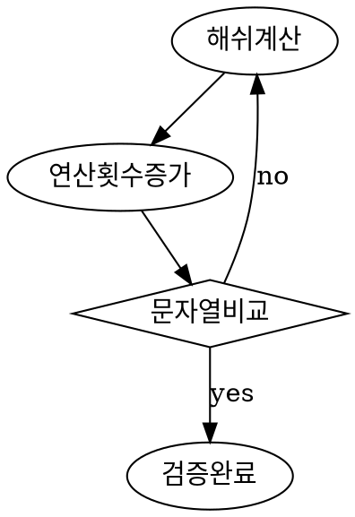

## Block Chain

관리 대상의 데이터 '블록'이라고 하는 데이터들을 P2P방식으로 생성된 체인 형식의 분산 데이터 저장 환경

누구라도 데이터를 임의로 수정할 수 없고 누구나 변경 결과를 열람할 수 있는 분산 컴퓨팅 기술 기반의 데이터 위변조 방지 기술

## 간단한 블록체인 구현

- Node.js를 기반으로 블록체인을 구현할 예정
- Javascript ES6
- SHA256 암호화 알고리즘 모듈 필요

## 블록의 구성

- 인덱스 : 
- 타임스탬프 :
- 데이터 :
- 이전 해쉬 :
- 해쉬 :
- 연산 횟수 :

## 블록 구현

### 블록 속성

~~~js
// 클래스 정의
class Block {
    // 생성자
    constructor(index, timestamp, data, previousHash) {
        // 인덱스
        this.index = index;
        // 타임스탬프
        this.timestamp = timestampm;
        // 데이터
		this.data = data;
        // 이전 해쉬
		this.previousHash = previousHash;
        // 해쉬
		this.hash = this.calculateHash();
        // 연산 횟수
		this.nonce = 0;
    }
}
~~~

- calculateHash는 현재 들어온 index, timestamp, data, previousHash, hash, nonce를 SHA256 암호화 계산하여 그 값을 리턴한다.

### calculateHash mineBlcok 메소드 정의

~~~js
import SHA256 from 'crypto-js/sha256';

class Block {
    // ...생성자
    constructor(index, timestamp, data, previousHash) { ... }
    // 해쉬 계산 메소드
    calculateHash() {
        return SHA256(this.index + this.previousHash + this.timestamp + this.data + this.nonce).toString();
    }
    // 블록 채굴 메소드
    mineBlock(difficulty) {
        // 0 ~ difficulty
        while(this.hash.substring(0, difficulty) !== Array(difficulty + 1).join('0')) {
            this.nonce++;
            this.hash = this.calculateHash();
        }

        console.log('Block mined ' + this.hash);
    }
}
~~~

- 블록 채굴 메소드 mineBlock은 다음에 정의될 블록체인에서 난이도(difficulty)를 변수로 받는다.
- 해쉬 문자열에서 난이도만큼의 문자를 비교

### 블록 검증절차

difficulty = 2인 경우

> 계산된 해쉬 c62b8e4162c75e1fe45dad6af8fcd2672a258941af50ee87f19eacfc190c2ce3
>
> nonce(연산횟수) 증가
>
> 해쉬 문자열 앞 2개의 문자가 '00'인지 비교
>
>  다를 경우 업데이트된 nonce(연산횟수)에 따라 해쉬 재적용
>
> 같은 경우 채굴 완료
> 
> 같을 때까지 해당 로직을 반복

## 블록체인 구현

### 블록체인 구성

- chain : 블록들의 배열
- difficulty : 블록체인의 난이도

블록체인을 만들기 위해선 이전에 초기 블록을 추가시켜 주어야 하므로

블록체인 생성시 chain속성에 의미없는 블록을 추가해준다.

~~~js
class BlockChain {
    constructor() {
        this.chain = [ this.createGenesisBlock() ];
        this.difficulty = 2;    // 임의로 지정한 것
    }
    // 
    createGenesisBlock() {
        return new Block(0, '01/01/2018', 'GenesisBlock', '0');
    }
}
~~~

### 블록체인에 블록 추가 메소드

~~~js
class BlockChain {
    // ...생성자
    ...
    // 최근 추가된 블록 찾기
    getLatestBlock() {
		return this.chain[this.chain.length - 1];
	}
    // 블록 추가 메소드
    addBlock(newBlock) {
		newBlock.previousHash = this.getLatestBlock().hash;
		newBlock.mineBlock(this.difficulty);
		this.chain.push(newBlock);
	}
}
~~~

- 블록 추가시 이전 블록의 해쉬를 참조해야한다.
- 추가되는 블록은 채굴 로직을 수행해야한다.
- 채굴 완료시 블록체인에 블록을 추가한다.

### 블록체인 유효성 검사

~~~js
class BlockChain {
    ...
    isChainValid() {
        for (let i = 1; i < this.chain.length; i++) {
			const currentBlock = this.chain[i];
			const previousBlock = this.chain[i - 1];

			if (currentBlock.hash !== currentBlock.calculateHash()) {
				return false;
			}
			if (currentBlock.previousHash !== previousBlock.hash) {
				return false;
			}
		}
		return true;
    }
}
~~~

- 체인으로 걸려있는 해쉬들을 다시 비교하여 블록체인이 유효한지 검사한다.

## 구현된 블록체인 생성하고 블록 추가해보기

~~~js
let testChain = new BlockChain();

console.time('Mining block 1');
console.log('Mining block 1...');
testChain.addBlock(new Block(1, '10/08/2017', { amount: 4 }));
console.timeEnd('Mining block 1');

console.time('Mining block 2');
console.log('Mining block 2...');
testChain.addBlock(new Block(2, '12/10/2017', { amount: 10 }));
console.timeEnd('Mining block 2');

console.log(JSON.stringify(testChain, null, 4));

console.log('Is blockchain valid? ' + testChain.isChainValid());
~~~

### 출력결과

~~~
Mining block 1...
Block minded 008184e0a5f7a9bc36ef14d2bfdc51e41acc25588572a5417d118d3883bbc6bb
Mining block 1: 24.866ms
Mining block 2...
Block minded 0065bf0059bf0d3765b7c63a349fe31d2f68690642c83f2d4bbcb4140f132693
Mining block 2: 8.445ms
{
    "chain": [
        {
            "index": 0,
            "timestampm": "01/01/2017",
            "data": "Genesis block",
            "previousHash": "0",
            "hash": "c62b8e4162c75e1fe45dad6af8fcd2672a258941af50ee87f19eacfc190c2ce3",
            "nonce": 0
        },
        {
            "index": 1,
            "timestampm": "10/08/2017",
            "data": {
                "amount": 4
            },
            "previousHash": "c62b8e4162c75e1fe45dad6af8fcd2672a258941af50ee87f19eacfc190c2ce3",
            "hash": "008184e0a5f7a9bc36ef14d2bfdc51e41acc25588572a5417d118d3883bbc6bb",
            "nonce": 157
        },
        {
            "index": 2,
            "timestampm": "12/10/2017",
            "data": {
                "amount": 10
            },
            "previousHash": "008184e0a5f7a9bc36ef14d2bfdc51e41acc25588572a5417d118d3883bbc6bb",
            "hash": "0065bf0059bf0d3765b7c63a349fe31d2f68690642c83f2d4bbcb4140f132693",
            "nonce": 151
        }
    ],
    "difficulty": 2
}
Is blockchain valid? true
~~~

 

## 난이도에 따른 채굴속도 체크

### Code

~~~js
import { Block, BlockChain } from './index';

let blockChain2 = new BlockChain();
let blockChain5 = new BlockChain();

blockChain2.difficulty = 2;
blockChain5.difficulty = 5;

console.time('blockchain2 mine');
blockChain2.addBlock(new Block(1, '01/01/2018', { amount: 5 }));
console.timeEnd('blockchain2 mine');

console.time('blockchain5 mine');
blockChain5.addBlock(new Block(1, '01/01/2018', { amount: 5 }));
console.timeEnd('blockchain5 mine');
~~~

### 출력

~~~
Block minded 007dd67f313dcf9f864f81879f2640cf1bfb731760cf72b50059d7aa7ba3540f
blockchain2 mine: 43.624ms
Block minded 0000084b77bcac70df92bc928d063d73d24191a7d1c76306f3dcd75c5cec49a0
blockchain5 mine: 10741.946ms
~~~

