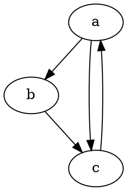

# React.js

UI를 구축하기 위한 자바스크립트 라이브러리

`youtube:https://www.youtube.com/embed/2Xc9gXyf2G4`

## 간단한 할 일 목록 앱

velopert님의 리액트 강좌를 참고!

React 코드를 직접 써보기로 한다.

프로젝트는 CodeSandbox를 이용

create Sandbox -> New Project에서 React선택

### 기본 로직

- 할일 목록
- 할일 추가
- 할일 삭제
- 할일 검색

### 데이터 구성

할일(Todo)

- 내용(content)
- 작성자(writer)

### 디렉토리

~~~
- public
- src
-- index.js
-- components
--- App.js
--- Todo.js
--- TodoCreate.js    // 
--- TodoDetail.js
~~~

### 일단 이번 포스팅에선..

1. 할일 목록 출력
2. 할일 추가

## 시작

CodeSandbox로 시작하기 때문에 babel, react 컴파일러가 기본적으로 세팅되어 있으므로 그거에 대한 내용은 다루지 않고, react코드만 다루는 걸로!

### 엔트리 파일 (index.js)

~~~javascript
// src/index.js
import React from "react";
import ReactDOM from "react-dom";

import App from "./components/App";
import "./styles.css";  // 아직 스타일은 적용 X

const rootElement = document.getElementById("root");
ReactDOM.render(<App />, rootElement);
~~~

맨 처음은 react-dom라이브러리로 컴포넌트와 이것이 들어갈 루트경로를 지정한다. 모듈단위로 컴포넌트를 import시키므로 코드를 간단하게 볼 수 있다.

App컴포넌트를 따라가면..

~~~javascript
// src/components/App.js
import React from "react";

// Components
import Todo from "./Todo";

class App extends React.Component {
  render() {
    return (
      

        <Todo />
      

    );
  }
}

export default App;
~~~

Todo 컴포넌트만 들어있다.

~~~javascript
// src/components/Todo.js
import React from "react";

// Components
import TodoCreate from "./TodoCreate";

class Todo extends React.Component {
  state = {
    todoList: [
      {
        content: "breakfast",
        writer: "hanyoung"
      },
      {
        content: "lunch",
        writer: "hanyoung"
      },
      {
        content: "dinner",
        writer: "hanyoung"
      }
    ]
  };
  createTodo = (content, writer) => {
    const { todoList } = this.state;
    this.setState({
      todoList: todoList.concat({ content, writer })
    });
  };
  render() {
    return (
      

        <h1>TodoList</h1>
        <ul>
          {this.state.todoList.map((todo, index) => {
            return <li key={`todo-${index}`}>{todo.content}</li>;
          })}
        </ul>
        <TodoCreate createTodo={this.createTodo} />
      

    );
  }
}

export default Todo;
~~~

해당 컴포넌트에는 할일 목록에 대한 데이터와 할일을 추가할 수 있는 메소드를 정의한다. 해당 데이터를 map함수를 통해 리스트렌더링을 수행. 할일 추가 메소드는 TodoCreate 컴포넌트에 props로 보냄. TodoCreate에서 폼UI 및 처리 수행.

~~~javascript
// src/components/TodoCreate.js
import React from "react";

class TodoCreate extends React.Component {
  state = {
    content: "",
    writer: ""
  };
  handleChange = e => {
    this.setState({
      [e.target.name]: e.target.value
    });
  };
  handleCreate = () => {
    const { content, writer } = this.state;
    this.props.createTodo(content, writer);
    this.setState({
      content: "",
      writer: ""
    });
  };
  render() {
    const { content, writer } = this.state;
    return (
      

        <input
          type="text"
          value={content}
          onChange={this.handleChange}
          name="content"
        />
         
        <input
          type="text"
          value={writer}
          onChange={this.handleChange}
          name="writer"
        />
         
        <button onClick={this.handleCreate}>CREATE</button>
      

    );
  }
}

export default TodoCreate;
~~~

### state, props

React에서 데이터를 다루기 위해 필요한 개념은 state, props이다.

state는 각각 컴포넌트마다 만들 수 있다.

~~~javascript
class TR1 extends React.Component {
    state = {
        todoList: [ ... ]
    }
    ...
}
~~~

state는 컴포넌트 렌더링 시에 사용될 수 있다.

props는 부모컴포넌트에서 받아올 수 있다.

~~~javascript
class Parent extends React.Component {
    render() {
        return (
            <Child data={true}>
        )
    }
}
class Child extends React.Component {
    render() {
        return (
            <h1>{this.props.data}</h1>
        )
    }
}
~~~

컴포넌트에 속성으로써 props를 전달 가능.

### setState

state를 수정하는 방법으로 state값을 직접 바꾸는 것이 아니라 setState함수로 state를 바꾸어야 한다.

### Array.map((item, index) => { ... })

배열 형태의 데이터를 react코드로 렌더링할 때 필요하다. 콜백함수로써 리스트아이템, 인덱스를 파라미터로 받고 리턴값을  가지고 새로운 배열을 결과값으로 만든다.